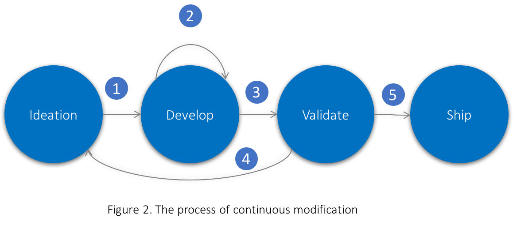
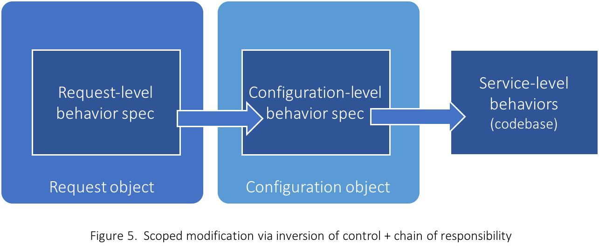

# Continuous modification: A process to build constantly evolving services

Software is already a living species. Today, massive data and timely feedback from users push decision-making cycles to be shorter and shorter: A feature of modest size released in quarterly cycle a few years ago, would be a minimal product exposed to a friction of users in a few hours today, and evolve to its best shape along with increasing exposure in the following weeks. Its implication is not that we do things faster, but we do to fail faster as to find a less travelled path to the true north, which is increasing important as systems get increasing complex.

An example is search engine, one of the most complex software on earth, which serves tens of thousands user queries per second and evolves daily with hundreds of ideas being experimented. It had to evolve at its fastest pace, otherwise it could be irrelevant in eighteen months. On the other hand, it had to be very stable and cost-efficient, after all, an hour’s downtime can make users switch, and lower cost-efficiency would gain competitive disadvantages in the long run.

A widely employed model to support fast innovation is [continuous deployment](https://en.wikipedia.org/wiki/Continuous_delivery#Relationship_to_continuous_deployment): production system get deployed in a hourly to weekly cadence, which is called release train. Individual features catch a train to ship its changes to production, or wait for the next. 

While hourly deployments work well for many products, it’s not good enough to serve products with hundreds of daily experiments, which is a norm in the era of big data and AI.  In this post, I will introduce a mechanism to tackle this problem, which I called *Hot Modification*, and a process on top named *Continuous Modification* to build such systems that can constantly evolve. We will also discuss necessary language constructs and design patterns to implement this mechanism.

##  Hot modification
Hot modification is a mechanism that enables modification of program logics while the service is serving requests without interruption, with the modified parts only impacting a set of controlled requests.


Being more verbose, it means
* Code can be changed (added, removed or modified) in program execution flow without suspending or stopping service
* Changed code should affect controlled requests only, which can be a single debug request, or a small percentage of user requests for A/B testing. Non-controlled requests will be served as if there is no change
* If there is a bug in changed code (like bad reference, dead loop, etc.), service should continue serving uncontrolled requests normally, and fail controlled requests only
* The cost of having this mechanism should be affordable during runtime

# Continuous modification
If we can have hot modification, we can set up an engineering process as following:



1) **Prototyping**: Starting from an idea, developer quickly prototype with a dynamic language, the code can be pushed to production along with a debug request. Developer is able to get see changed result instantly.
2) **Iteration**: the prototype is iterated multi-round using hot modifications, until an expected output is met.
3) **Validation**: check if the prototype can lead to positive gains on desired metrics, by allocating a percentage of production traffic for A/B testing
4) **Failing**: if validation result turns out not good enough, developer comes back to ideation stage to further improve the idea, or simply drop the idea
5) **Graduation**: if validation result is good, then the hot modified code is checked into codebase, and get optimized to meet the performance goal. After passing functional test and an additional validation, the feature will be turned on with 100% traffic.

The essence of this process is to **get feedback as early and as frequently**.  Let’s see how this process compares to traditional process that we do development offline. 

|       | Continuous modification | Traditional developement |
|-------|-------------------------|-------------------------|
| Input consistency between dev environment and production | Yes | No |
| Output consistency between dev environment and production | Yes | No |
| Turnaround time between iterations | 1 click | 1 deployment |
| Access to end-to-end metrics | Yes | No
| Check in before code proved useful | No | Yes |
| Dead code in production | No | Yes (unless there is a process deleting unused code) |

Don’t underestimate these differences, they can sum up into a multitude in productivity thus innovation pace, especially when an idea is complex and need tuning for many iterations. Worthy noting, some ideas may never get started in traditional development process due to unaffordable iteration overhead, but enjoyable with continuous modification.

This sounds cool, but can it be implemented?

## Implementing continuous modification
Continuous modification depends on two mechanisms: hot modification and prototype graduation.

### Hot modification
Let’s see what shall the program look like if it supports hot modification. 

There are four traits:
1) **Specified modification**: modify code at a specified location of execution graph. Program can define what locations can be modified, and what cannot. This also guard untouchable logics from being modified.
2) **Scoped modification**: modify code should be effective within an applied scope: during development, modification is effective at per-request level, during A/B test at per-configuration level, and during shipping at service level. 
3) **Bad effect quarantine**: If bad modification happens (e.g. bad reference, exception thrown, dead loop, etc.), service should only fail the request without impacting other requests, and no server side state shall be changed.
4) **Performance**: Hot modified code can run reasonable fast, which may be used for A/B testing without offline optimization. 

To support runtime code modification, the service needs to load code dynamically. Compiled assemblies like shared library is difficult to fit in, as they are not designed to carry within a request, yet they cannot effectively locate functions in host process, so a modified function calling back to existing service logics is not possible. Dynamic languages like JavaScript, Python, Lua, and etc. are the candidates, which provide the capability to get a function from string, automatically figuring out dependent code under the context.

To protect from bad code, the language should be able to terminate a running code, catch runtime errors and continue, without messing up program states.

Also the language itself should be reasonable fast, so it can serve validation traffic without going through graduation. It should be able to interop with native code, so later we can graduate performance critical part to native language. 

After comparing these languages, we have chosen JavaScript. Aside from providing all these traits, it’s thoroughly tested in back-end systems on Node.js, not mentioning its big module eco-system on NPM and huge population in developer community.

Finally, the program structure with hot modification enabled would look like: 


### Specified modification
With the ability to inject code as objects at runtime, we can easily implement mechanism to override specific functions via [inversion of control](https://en.wikipedia.org/wiki/Inversion_of_control). 

Pseudo code would look like:

```ts
function service_main(request: Request) : any {
    // fun1 can be modified.
    Request.get(‘fun1’)(request.input);

    // fun2 cannot be modified
    fun2(request.input)
}

function fun1(request.input) {
    fun1_1(request.input.a);
    fun1_2(request.input.b);
}
```
When issuing the request, we can add an overridden logic of  `fun1` in request, which insert function call to `fun1_1’` before `fun1_1` and detour `fun1_2` to `fun1_2’`.

```json
{
 “input”: { 
     "a": "a string value",
     "b": 1 
 },
 “override”: {
    “fun1”: “function(input) \{ fun1_1’(input.a); fun1_1(input.a); fun1_2’(input.b); \}”
 }
}
```
`fun2` cannot be overridden since `service_main` doesn’t call it without indirection. Service owner should decide what functions are booked for developers to quick innovate, and what shall stay stable.


### Scoped modification
One step further, we will not always push modified code from request, which comes with a cost of parsing, JIT, and loading resources that can actually live longer than the request. When we move forward to A/B testing, we need to load the code once, and apply to all requests which uses the configuration. And finally, when code is graduated to production, we will configure a service level default for its overridable functions.

Accordingly, it takes a priority to choose the right version of function for a name among service code, A/B test configuration, or from a request. Naturally, if a function is overridden from a request, it is chosen despite a configuration-level override, while the latter is always chosen over service-level default. 

This overriding chain is a perfect use case for the [chain of responsibility](https://en.wikipedia.org/wiki/Chain-of-responsibility_pattern) pattern.



Pseudo code would look like:

```ts
class FunctionContext  {
    private _parent: FunctionContext;
    private _functions: any;

    constructor(parent?: FunctionContext) {
        this._parent = parent;
    }
    
    public get(name: string): (args...: any[]) => any {
        if (this._functions[name] != null) {
            return this._functions[name];
        }
        return this._parent == null ? 
            null : this._parent.get(name);
    }
}

class Request: FunctionContext {
    constructor(Configuration config) {
        FunctionContext(config);
    }
    // ...
}

class Configuration: FunctionContext {
    constructor(Service service) {
        FunctionContext(service);
    }
    // ...
}

class Service: FunctionContext {
   constructor() {
       FunctionContext();
   }
   // ...
}
```
### Bad effect quarantine
We are focusing on scenarios of human mistakes other than malicious users, given hot modification should always be limited to internal developers.
 
If we look at the most common mistakes in a bad code, they probably can be classified as 1) bad reference to an object, 2) unhandled error, 3) buffer overrun,  4) long running loops or dead loop, 5) memory leak.

Bad reference and unhandled error can be easily handled by catching error at top level function, and respond failure. Buffer overrun should be addressed at API level. Handling dead loop is more tricky, which needs language level support to be able to terminate execution. Fortunately v8 engine (JavaScript) provided a API to terminate a thread from another thread, which simply unwind stack as handling an exception, and there is almost zero cost to recover that thread from serving new requests.

Also we need to avoid bad code that would mess up service’s state (global objects, etc.), this can be done by either making service state read-only when serving request, or make a copy of necessary fields that needs to be manipulated.

### Performance 
Performance is definitely a deal breaker for hot modification to work, which has two aspects: 
* **Short term performance**: Can we directly rollout hot modified code in A/B test?
* **Long term performance**: Can we eventually achieve native code performance with a graduation process? 

On short term performance, the answers is depends, if you are really creating a big feature using hot modification, and have very restricted latency budget, then you probably need at least one round of graduation process to help you optimize the bottleneck. But in most cases, hot modification should work, here is my math:

If a service has latency of 100ms, and a feature using hot modification contains 5% of logics of the whole program, which is implemented in JavaScript. Currently, JavaScript is almost 3 times slower than native code, then you would get (1 + 3 * 5%) = 115ms. 

15ms latency increase for a period of A/B test seems a worthy investment. Indeed, when a service become as complex as a search engine, a single feature usually is much less than 5% code. And it would be a good idea to allocate latency budget for validation, since they will eventually be returned from the graduation process, yet saving a lot of unnecessary pre-optimization effort. 

On long term performance, the answer is simply **yes**. We can freely balance the ratio between dynamic code and native code, an extreme case is that dynamic code are only used for workflow and function binding, so computation heavy logics will always be put in native code. Yes, there is interop cost between languages, but if we handle them carefully, they should be a small margin, which we will touch in the graduation process.

## Prototype graduation
The graduation process is to merge hot modification to production codebase, and do necessary optimizations for code that cannot be optimized online.

There is no difference for merging code back into production codebase from traditional development process, the tricky part is to convert hot modified code written in dynamic language into native code.

There are three goals to achieve for conversion:
1) **Same interface**: Keep dynamic language interface, so it can be invoked as module by hot modified code in future
2) **Input robustness**: Native code should be robust at different input, even inputs not in current production usage. This is essential to prevent crash triggered by future hot modified code
3) **Performance**: Interop cost between languages should be minimized 

There is nothing special to achieve the first two goals, but there are some tips to achieve the third.
* Pointer exchange: this is preferred when a native module communicate with another native module, dynamic language is involved as a mediator. We can directly pass the native structure pointer as a 64-bit integer or two 32-bit integers in dynamic language.
* Using types sharing the same layout across languages: minimizing copy is important, we should share string without copy, and large set of values using array buffer, etc.
* Take advantage of optimizations in language implementation: hidden class optimization (V8), preference of using array of uniform types, etc.

## Conclusion
In this post, a mechanism *hot modification* is proposed for modifying code online without impacting service quality, based on which we introduced a new engineering process *continuous modification*, which enables developer to innovate on production continuously. We have implemented this mechanism and process in Microsoft using JavaScript and C++, from which we got 10x agility improvement on ML feature experimentation, if not more.

The mechanism of hot modification and the process of continuous modification are universal, I earnestly hope that it could be employed in different types of systems to see how it boosts innovation.

